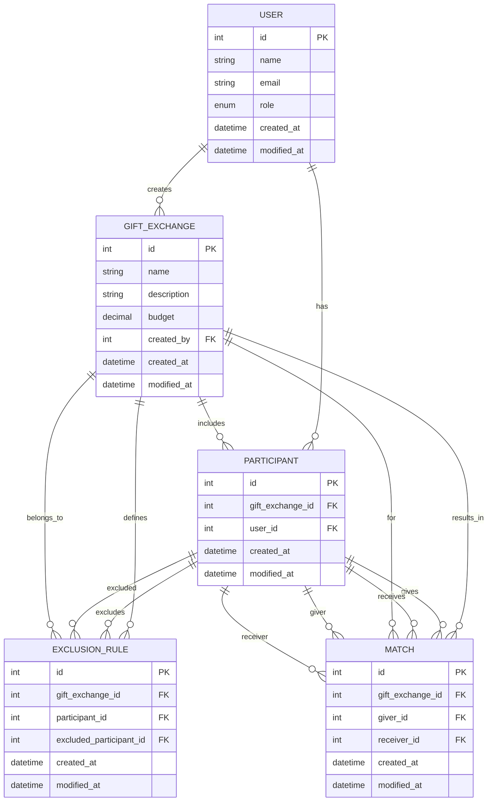

<p align="center">
   <div style="font-size:5rem; text-align:center">🎅</div>
</p>

# Secret Santa Backend (NestJS)

## 📖 Overview

This is a backend API for managing a Secret Santa gift exchange, built with [NestJS](https://nestjs.com/) and PostgreSQL. It supports user management, gift exchanges, participant management, exclusion rules, and automated Secret Santa matching.

---

## 📝 Problem Statement

Organizing a Secret Santa event manually is error-prone, especially with exclusions (e.g., "don't match me with my spouse"). This backend automates the process:

- Allows an admin to create a gift exchange.
- Users can be added and assigned as participants.
- Exclusion rules can be set (e.g., "A cannot give to B").
- The system generates valid Secret Santa matches, respecting all exclusions.

---

## ⚙️ Technical Stack

- **Framework:** [NestJS](https://nestjs.com/)
- **Database:** PostgreSQL (via [TypeORM](https://typeorm.io/))
- **Validation:** class-validator
- **API:** RESTful, JSON responses

---

## Project setup

### 1. **Clone the repository**

```bash
git clone <your-repo-url>
cd secret-santa
```

### 2. **Install dependencies**

```bash
npm install
```

### 3. **Configure environment variables**

Create a `.env` file in the root directory and set your PostgreSQL credentials:

```
PG_HOST=host
PG_UNAME=your_pg_username
PG_PW=your_pg_password
PG_DB=your_pg_database
NODE_ENV=development
PORT=3000
```

### 4. **Run the database**

Make sure PostgreSQL is running and the database exists.

### 5. **Start the server**

```bash
npm run start:dev
```

The API will be available at `http://localhost:3001`. PostMan collection available at /documentation

---

## 🏗️ Entity-Relationship Diagram



---

## Deployment

---

## 📝 Notes

- Exclusion rules are optional.
- The matching algorithm will throw an error if a valid assignment is not possible due to exclusions.
- All API responses are JSON.

---
